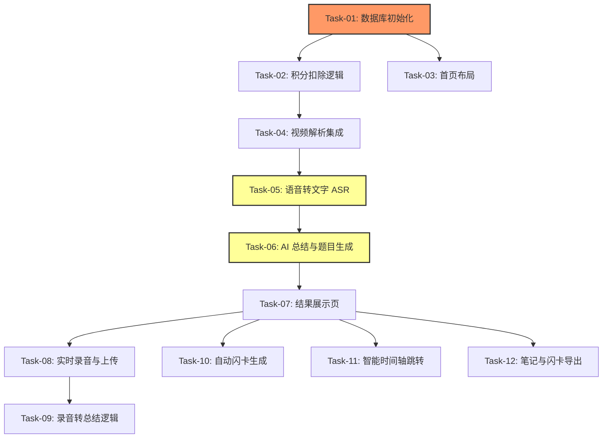

# AI 视频/音频学习助手 ― 开发任务计划

## 1. 任务概览

**总任务数**：12 个
**预计总工时**：720 分钟（约 12 小时）
**开发方法**：TDD ― 每个任务按 RED → GREEN → REFACTOR 循环执行

**关键标注**：
- ? 阻塞任务：被多个任务依赖，建议优先完成
- ?? 风险任务：技术难度高，可能需要额外时间

### 依赖关系图

### 可并行任务组

| 并行组 | 任务 | 说明 |
|--------|------|------|
| 1 | Task-08, Task-10, Task-11 | 这些功能相对独立，可以在核心流程通了之后并行开发。 |

---

## 2. 开发任务

### 阶段一：基础设施与积分系统

**阶段完成标准**：数据库集合已创建，用户可以看到自己的积分余额并能触发简单的积分扣除。

---

#### Task-01: 数据库初始化 ?

**通俗解释**：在云端准备好存储学习笔记和用户积分的“抽屉”。

**做什么**：在微信云开发控制台创建 `study_records` 和 `user_wallets` 集合，并设置基础权限。

**涉及文件**：`cloudfunctions/quickstartFunctions/index.js`

**参考**：技术方案 3.1 → AC-001

**依赖**：无

**预估工时**：30 分钟

**验证标准**：
- [ ] 尝试读取 `study_records` 集合 → 返回空数组（非报错）
- [ ] 尝试为新用户初始化 `user_wallets` → 成功插入 `{ points: 10 }`

---

#### Task-02: 积分扣除逻辑 (Backend) ?

**通俗解释**：当用户开始学习时，系统会自动计算并扣掉相应的“学习币”。

**做什么**：编写云函数逻辑，根据视频时长计算积分并检查余额。

**涉及文件**：`cloudfunctions/processStudyTask/index.js`

**参考**：技术方案 5.1 → BR-002, AC-005

**依赖**：Task-01

**预估工时**：60 分钟

**验证标准**：
- [ ] 输入时长 600s (10min) → 扣除 1 积分，返回成功
- [ ] 输入时长 601s (10min 1s) → 扣除 2 积分 (向上取整)
- [ ] 余额不足 (points: 0) → 返回 `POINTS_INSUFFICIENT` 错误

---

### 阶段二：核心流程 ― 视频链接转总结

**阶段完成标准**：用户粘贴 B 站/抖音链接后，能看到转录出的文字和 AI 生成的大纲。

---

#### Task-04: 视频解析集成 ??

**通俗解释**：让程序能读懂用户粘贴的视频链接，并拿到视频背后的真实地址。

**做什么**：集成第三方视频解析 API (如 Videoparse)，获取视频时长和原始 MP4 地址。

**涉及文件**：`cloudfunctions/processStudyTask/index.js`

**参考**：技术方案 1.0 → AC-001, AC-004

**依赖**：Task-02

**预估工时**：90 分钟

**验证标准**：
- [ ] 输入有效 B 站链接 → 返回 `duration` (Number) 和 `video_url` (String)
- [ ] 输入无效链接 → 返回解析失败错误码

---

#### Task-05: 语音转文字 (ASR) 集成 ??

**通俗解释**：把视频里的声音提取出来，“听写”成一段文字。

**做什么**：调用腾讯云/阿里云 ASR 接口，处理视频音频流并返回全文文本。

**涉及文件**：`cloudfunctions/processStudyTask/index.js`

**参考**：技术方案 1.0 → AC-001

**依赖**：Task-04

**预估工时**：120 分钟

**验证标准**：
- [ ] 输入 1 分钟音频文件 → 返回一段连贯的文本
- [ ] 模拟超长音频 (30min+) → 触发异步识别逻辑

---

#### Task-06: AI 总结与题目生成 ??

**通俗解释**：让 AI 读完文字后，写出总结、重点和考试题。

**做什么**：设计 Prompt 并调用 LLM API，将文本转为结构化 JSON 结果。

**涉及文件**：`cloudfunctions/processStudyTask/index.js`

**参考**：技术方案 5.2 → AC-003

**依赖**：Task-05

**预估工时**：90 分钟

**验证标准**：
- [ ] 输入转录文本 → 返回包含 `summary`, `quiz`, `flashcards` 字段的 JSON
- [ ] 确保 `quiz` 中包含题目、选项、答案和解析

---

### 阶段三：实时录音与增强功能

**阶段完成标准**：用户可以现场录音，并在结束后看到同样的 AI 总结和导出笔记。

---

#### Task-08: 实时录音与上传

**通俗解释**：在讲座现场点一下“开始录音”，声音就会实时传到云端。

**做什么**：实现小程序端的录音 UI、波形展示，并在录音结束后上传至云存储。

**涉及文件**：`miniprogram/pages/summarize/index.js`, `miniprogram/pages/summarize/index.wxml`

**参考**：技术方案 4.0 → AC-002

**依赖**：Task-07

**预估工时**：90 分钟

**验证标准**：
- [ ] 点击开始录音 → 界面显示动态波形
- [ ] 点击停止录音 → 文件成功保存到云存储，并返回 `fileID`

---

#### Task-10: 自动闪卡生成

**通俗解释**：把重点知识变成电子单词卡片，方便背诵。

**做什么**：在结果页渲染 AI 生成的闪卡（正面问题，背面答案）。

**涉及文件**：`miniprogram/pages/result/index.wxml`, `miniprogram/pages/result/index.js`

**参考**：技术方案 5.2 → AC-003

**依赖**：Task-06

**预估工时**：45 分钟

**验证标准**：
- [ ] 页面展示卡片组件 → 点击可翻转查看背面内容

---

#### Task-12: 笔记与闪卡导出

**通俗解释**：把总结好的内容存到手机里，或者发给电脑。

**做什么**：实现 Markdown 和 PDF 的生成逻辑，以及 Anki 格式的文本导出。

**涉及文件**：`miniprogram/pages/result/index.js`

**参考**：技术方案 5.4 → AC-005

**依赖**：Task-07

**预估工时**：60 分钟

**验证标准**：
- [ ] 点击导出 Markdown → 成功复制到剪贴板，内容包含结构化标题
- [ ] 点击导出 Anki → 生成 Tab 分隔的文本文件

---

## 3. AC 覆盖总表

| AC 编号 | 验收标准概述 | 承接任务 | 验证方式 |
|---------|-------------|---------|---------|
| AC-001 | 视频链接一键处理 | Task-04, 05, 06 | 输入 B 站链接，端到端看到总结结果 |
| AC-002 | 实时语音录入 | Task-08 | 现场录音并看到波形，录完后触发转录 |
| AC-003 | 结构化 AI 输出 | Task-06, 10 | 页面展示总结、题目和闪卡三个板块 |
| AC-004 | 智能时间轴跳转 | Task-11 | 点击总结中的时间点，音视频跳转播放 |
| AC-005 | 笔记与闪卡导出 | Task-12 | 成功导出 Markdown/Anki 文件 |
| AC-006 | 超长视频处理 | Task-02, 05 | 处理 120 分钟视频，扣除对应积分并返回总结 |

---

## 4. 完成定义

- [ ] 所有任务的验证标准（测试用例）通过
- [ ] AC 覆盖总表中每条 AC 的验证方式已执行并通过
- [ ] 积分扣除逻辑在真实账户下验证通过
- [ ] 抖音、B 站、小红书链接解析在真机调试下通过
- [ ] Markdown 导出内容在 Notion/Obsidian 中渲染正常
